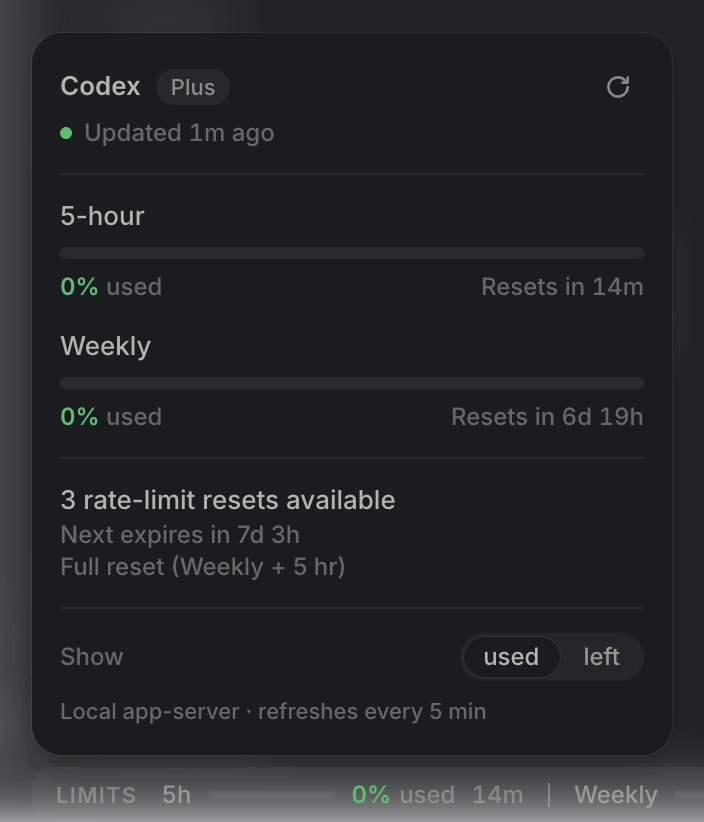

# codex-limitbar

A rate-limit status bar for the **ChatGPT desktop app** (macOS). It shows your Codex usage
windows — percent used and time to reset — in a slim strip at the bottom of the app
window; click it for a details panel with plan, reset credits and refresh. Both follow the
app's light/dark theme.


```
LIMITS  5h  ▁▁▁▁▁▁  0% used  3h 45m  |  Weekly  ███▄▄▄  73% used  19h 48m                 ● ⌃
```



Nothing inside `/Applications/ChatGPT.app` is modified: the bar is injected at runtime into
the app's local UI over the Chrome DevTools Protocol (CDP).

## Risks — read before installing

- **An open debugging port for as long as ChatGPT runs.** The app is launched with
  `--remote-debugging-port` on a random `127.0.0.1` port, and that port cannot be closed
  until the app quits. While it is open, **any process running as your macOS user can
  drive the ChatGPT window and read its session state** — this bypasses the cookie
  encryption the app enables. Web pages cannot connect (Chromium rejects DevTools
  websocket connections that carry a browser `Origin`), but local software can. Stopping
  the bar does not close the port; only a normal restart of ChatGPT does.
- **It can stop working with any app update.** ChatGPT 26.924.22138 closed the previous
  method (see [How it works](#how-it-works)); OpenAI can close this one the same way,
  without notice.
- **Terms-of-service gray zone.** Runtime UI injection into a third-party app. This project
  is **not affiliated with OpenAI**. The app ships device-attestation and integrity
  plumbing that may react to unusual runtimes. Use at your own risk.
- **Fully removable.** `./uninstall.sh --restart-app` removes everything and closes the
  port — see [Uninstall](#uninstall).

## How it works

1. `start.sh` launches ChatGPT with `--remote-debugging-port=<random port in 20000–40000>`.
2. `limitbar.mjs` (a small Node agent) verifies the port really belongs to
   `/Applications/ChatGPT.app` — port owner process, CDP endpoint, the exact
   `app://-/index.html` shell page and the shell's own globals — and refuses otherwise.
3. The agent injects `bar.js` into the shell page and registers it to run on every
   reload, so the bar survives window reloads.
4. Limits are read from the app's own bundled `codex app-server` (stdio JSON-RPC,
   `account/rateLimits/read`) every 5 minutes and after the Mac wakes, and pushed into
   the bar.
5. The agent exits when ChatGPT quits.

Why CDP: up to build 26.917 the bar was installed through the Electron main-process
inspector (`--inspect`). ChatGPT 26.924.22138 moved to OpenAI's Owl engine and disabled
the `EnableNodeCliInspectArguments`, `RunAsNode` and `EnableNodeOptionsEnvironmentVariable`
fuses (and enabled asar integrity), so that path is closed. The Chromium
`--remote-debugging-port` switch is not fuse-controlled. Methodology and recon notes:
[electron-app-patching](https://github.com/Prontsevich/electron-app-patching).

## Requirements

- macOS, ChatGPT desktop app in `/Applications` (another location:
  `CODEX_LIMITBAR_APP=/path/to/ChatGPT.app`)
- Node.js **22 or newer** (the agent uses the built-in `WebSocket`). `start.sh` looks in
  `CODEX_LIMITBAR_NODE`, `PATH`, Homebrew (`/opt/homebrew/bin`, `/usr/local/bin`), mise
  shims, Volta and nvm — so launchers with a minimal `PATH` (Raycast) still find it.
- A signed-in Codex account (the app's bundled CLI answers the limits query).

## Install

```bash
git clone https://github.com/Prontsevich/codex-limitbar.git
cd codex-limitbar
./install.sh          # optional: links a `codex-limitbar` command into ~/.local/bin
./install.sh --check  # show what is installed
```

`CODEX_LIMITBAR_BIN_DIR` overrides `~/.local/bin`.

## Run

```bash
codex-limitbar        # or: ./start.sh
```

`start.sh` picks one of three paths:

| Situation | What happens |
|-----------|--------------|
| Agent already attached to the running app | **Fast path:** just brings ChatGPT to the front |
| ChatGPT runs with a debugging port, no agent | Starts the agent against that port |
| ChatGPT runs without a debugging port (or is not running) | Quits it gracefully once, relaunches it with a random port, starts the agent |

Flags:

```bash
./start.sh --status    # app pid / CDP port / agent state, changes nothing
./start.sh --stop      # stop the agent: the bar disappears live (the port stays open)
./start.sh --capture   # run as usual + save last-run.png of the main window
```

A normal launch of ChatGPT (Dock, Spotlight, Raycast app search) shows **no bar** — open
it through `codex-limitbar` / `start.sh` / the Raycast command below instead.

### Raycast

```bash
./install.sh --raycast            # links raycast/codex-limitbar.sh into ~/.config/raycast/scripts
./install.sh --raycast ~/my/dir   # or into your own script-commands directory
```

Then in Raycast: **Settings → Extensions → Script Commands → Add Directories** → pick that
directory. Search **"Open ChatGPT with LimitBar"** and give it an alias (e.g. `chatgpt`) or
a hotkey so it replaces the plain app launch. The command runs `start.sh` and shows its
final status line; when the bar is already active it only brings the window forward.

## What it looks like

- Sits in the window frame's bottom gutter, aligned with the app's inset content card; it
  **reserves** its 28 px (padding on the app's layout container) and never covers the
  sidebar, composer or any control. The icon rail stays clean.
- Colors come only from the app's own theme tokens (`--app-color-*`), so the bar follows
  light/dark switches instantly.
- Per limit: `[name] [mini bar] [NN% used] [time to reset]`; hover the time for the exact
  reset moment. Color by the amount **remaining**: ≥ 50 green, ≥ 25 yellow, ≥ 10 orange,
  < 10 red.
- A status dot on the far right: green = live, orange = stale (data older than 15 minutes
  or the last read failed). Before the first read the bar says `waiting for data…`.
- One limit row is normal — the 5-hour window is suspended for many accounts.
- On narrow windows the label and reset times are hidden.

**Details panel** — click the bar (or focus it and press Enter/Space). It opens above the
bar in the app's own menu style and closes on a click outside, Escape, or a second click:

- Header: `Codex`, plan badge, `Updated 3m ago` with the live/stale dot, and a refresh
  button that asks the agent for an immediate read (throttled to one read per 10 s).
- Per limit: a full-width bar, `NN% used|left` and `Resets in 2h 13m` (hover: exact time).
- Reset credits: how many are available, when the next one expires, and its title.
  (Using a credit stays in ChatGPT itself — the panel only shows them.)
- Warnings when a limit or the spend limit is reached, usage is not allowed, or the last
  read failed (with the error).
- `Show used | left` toggle (persisted; applies to the bar too).

## Uninstall

```bash
./uninstall.sh --check         # dry run: list what would be removed
./uninstall.sh                 # remove everything
./uninstall.sh --restart-app   # … and quit + reopen ChatGPT normally (closes the port)
./uninstall.sh --purge         # … and delete ~/.codex-limitbar-backups
```

`uninstall.sh` stops the agent (the bar disappears from the live window and its saved
display mode is cleared), removes the `codex-limitbar` command and the Raycast link (only
if they are our symlinks), removes skill symlinks that point into this repo, the state
directory and the logs. Skill-install backups are kept unless `--purge`. The ChatGPT app
is never modified. Without `--restart-app` the debugging port stays open until you quit
and reopen ChatGPT yourself. `./install.sh --uninstall` does the same. Delete the repo
directory afterwards.

## Troubleshooting

Files:

- Log: `~/Library/Logs/spr-limitbar.log` — identity check, injections, reloads, every
  limits read.
- Agent state: `~/Library/Application Support/spr-limitbar/agent.json`
  (`{pid, port, app, appPid, barVersion, startedAt}`), removed when the agent exits.

Common cases:

- **No bar after a normal launch** — expected; use `codex-limitbar` / Raycast.
- **`REFUSING: port … is not owned by /Applications/ChatGPT.app`** — something else is
  listening on that port; the agent will not touch it. Quit ChatGPT and run `start.sh`
  again (it picks a fresh free port).
- **`no app://-/index.html page target`** — the main window is not open yet or was closed;
  open it and re-run `start.sh`.
- **`Node.js >= 22 not found`** — install Node 22+, or point `CODEX_LIMITBAR_NODE` at it.
- **Bar says `limits unavailable` or `stale`** — the limits read fails (open the panel for the error). Check the log for
  `limits ERR`, then probe the CLI directly:
  `python3 skills/codex-limitbar/scripts/probe_rate_limits.py /Applications/ChatGPT.app/Contents/Resources/codex-cli/bin/codex`.
  If the probe fails too, run `codex login` (or sign in inside the app) and retry.
- **Bar gone after a ChatGPT update** — Sparkle relaunches the app without the port; run
  `codex-limitbar` again. If it still fails, the update may have closed the method — see
  [Risks](#risks--read-before-installing).
- **"limits unavailable" inside ChatGPT itself** — that message comes from OpenAI's client,
  not this tool; restarting ChatGPT usually clears it.

## In-page hooks

Evaluate in the shell page, e.g.
`node skills/codex-limitbar/scripts/cdp-eval.mjs --port <p> -e 'JSON.stringify(__sprBarGetState())'`
(the port is in `start.sh --status`):

| Hook | Purpose |
|------|---------|
| `__sprBarSetLimits([{name, usedPercent, resetsAtMs, windowDurationMins?}], meta)` | push limits + `{live, planType, resetCredits, resetCreditsNextExpiresAtMs, resetCreditTitle, limitReached, spendControlReached, usageAllowed, updatedAtMs, error?}` |
| `__sprBarSetMode('used' \| 'left')` | switch display mode |
| `__sprBarSetPanel(true \| false)` | open / close the details panel |
| `__sprBarGetState()` | `{version, mode, live, limits, meta, theme, panelOpen}` |
| `__sprBarRemove()` | full teardown, restores the layout exactly |

## Development

```bash
node --test                          # unit tests (limits parser, window names, binary lookup)
for f in limitbar.mjs lib/*.mjs bar.js; do node --check "$f"; done   # syntax
bash -n start.sh install.sh uninstall.sh
```

Contributor rules are in [`AGENTS.md`](AGENTS.md).

## For coding agents

This repo ships the **`codex-limitbar`** skill (`skills/codex-limitbar/`): install, run,
diagnose and remove the bar; the app-server rate-limits protocol. Install it into every
agent harness found on the machine:

```bash
./install-skills.sh          # symlinks into ~/.claude, ~/.codex, ~/.cursor, ~/.hermes, ...
./install-skills.sh claude   # or target specific harnesses
./install-skills.sh --check  # report drift, change nothing
```

The general methodology for injecting UI into third-party Electron apps (fuses, runtime
injection, CDP, repack) now lives in its own repo:
[electron-app-patching](https://github.com/Prontsevich/electron-app-patching).

## License

MIT
